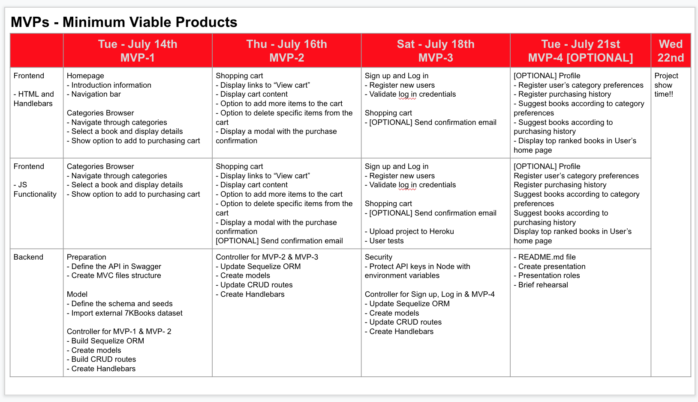
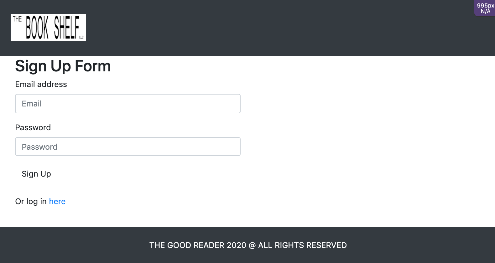
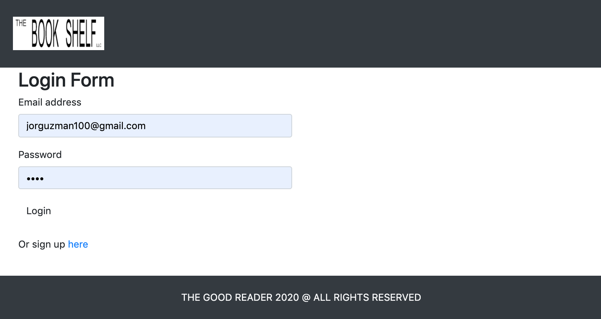
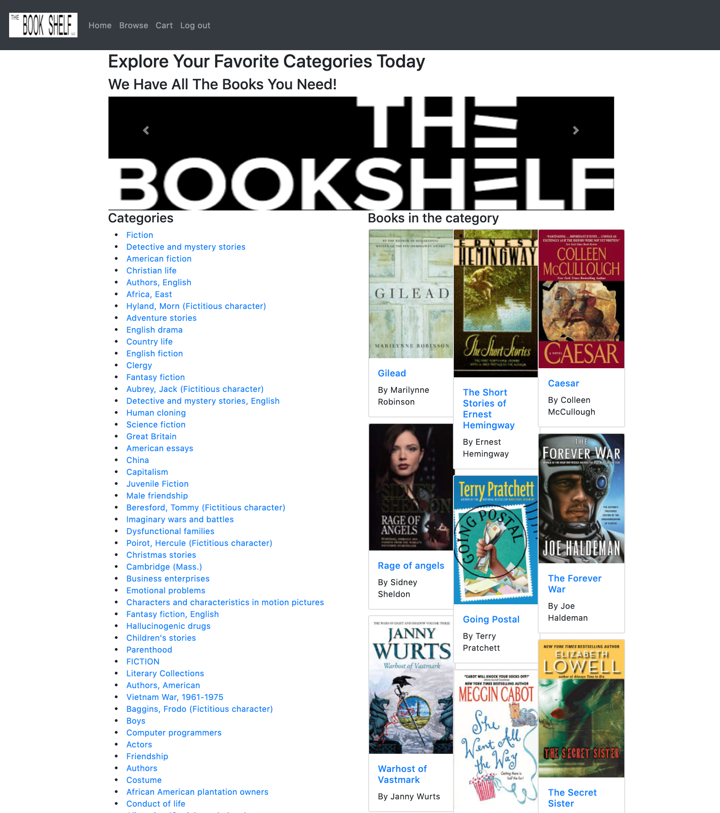
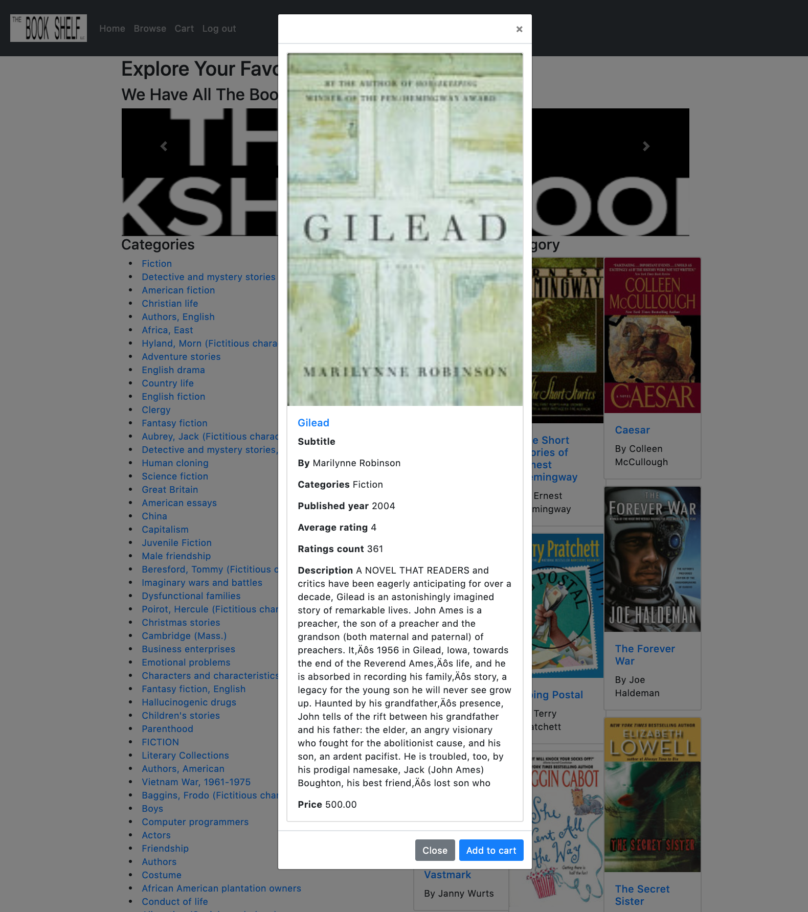
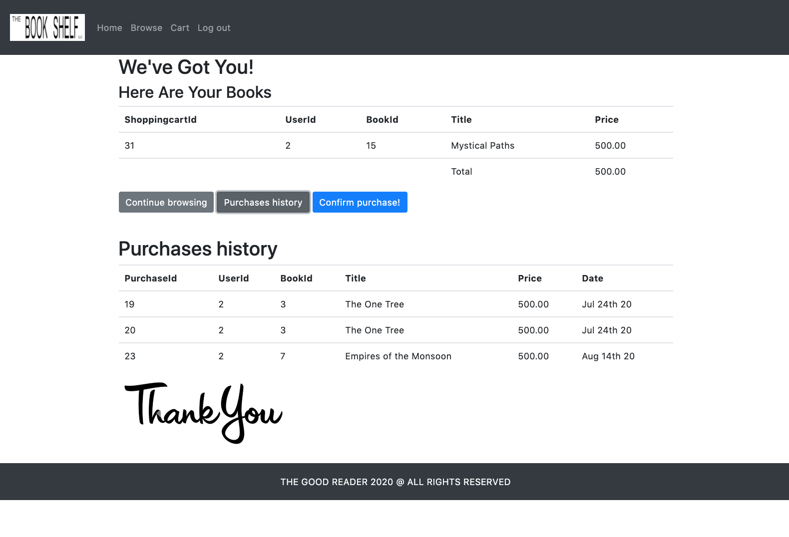

# The Book Shelf

The Book Shelf is a full stack web application where a user can register, browse in a book database, select books and add them to a purchasing cart, keep record of user’s purchase history, and request authentication to have access to the main functionality.

## Badges

Code quality and validation

Repository Status

License

## Table of contents

- [The Book Shelf](#the-book-shelf)
  - [Badges](#badges)
  - [Table of contents](#table-of-contents)
  - [The challenge](#the-challenge)
  - [The development process](#the-development-process)
  - [The Output](#the-output)
  - [Installation and Usage](#installation-and-usage)
  - [Credits, tools and other references](#credits-tools-and-other-references)
  - [Contributing](#contributing)
  - [Questions](#questions)

## The challenge

Create a Full Stack Web Application with the following features:

- [x] Use a Node and Express web server
- [x] Backed by a MySQL database with a Sequelize ORM
- [x] Use an existing public dataset to power the database (Kaggel 7K Books)
- [x] Migration strategy using seeds and schema files
- [x] Routes for retrieving and adding new data
- [x] Incorporate authentication (Passport, BCrypt)
- [x] Folder structure that meets the MVC paradigm
- [x] Use Handlebars for server-side templating
- [x] Protected API keys in Node with environment variables
- [x] Polished front end/UI
- [x] Meet good-quality coding standards (indentation, scoping, naming, etc.)
- [x] Deployed using Heroku (with data)

## The development process

In order to accomplish the challenge, the following steps were done:

1. Brain storming to define the project main concept.
2. External datasets research.
3. Define the purpose, and concept of the application.
4. Define the team members roles.
5. Define MVPs (Minimum Viable Products) and due dates.
6. Create sketches.
7. Define the routes, requests and responses structure.
8. Front end and back end coding.
9. Integrate full stack application.
10. Final review and proper documentation.

## The Output

With the described process we were able to create an angaging, useful and efficient full stack web application.

**User stories**

1. As a user I want to navigate through categories, and select a book, so I can read detail information about it
2. As a user I want to select books, add them to a purchasing cart, review information and confirm purchase, so I will receive a confirmation of my operation.
3. As a user I want to pass through an authentication process, so that I can feel confident that the site is secure and keep the record of my operations.

**The application**

## Installation and Usage

The project was uploaded to [GitHub](https://github.com/) at the following repository:
[https://github.com/jorguzman100/project2](https://github.com/jorguzman100/project2)

You can access the deployed application with the Heroku link:
[https://safe-basin-04900.herokuapp.com/](https://safe-basin-04900.herokuapp.com/)

To install the project follow these steps:

1. Clone the application from GitHub with:

   - git clone [clone link from GitHub]

2. From the root folder, install the dependencies with:

   - npm install

3. Run the app with:
   - node server.js

## Credits, tools and other references

**Colaborators**

Our appreciation for those who have contributed to the project:

Front End

[Anel Ramirez](https://github.com/AnelRaSant)

Front End

[Jimena Pereda](https://github.com/JimenaPereda)

Project Leader and BackEnd

[Jorge Guzman](https://github.com/jorguzman100)

**Third Party Assets**

[Kaggle Datasets](https://www.kaggle.com/)

[Passport Authentication](https://www.npmjs.com/package/passport)

[BCrypt hash password](https://www.npmjs.com/package/bcrypt)

[Balsamiq](https://balsamiq.com/)

[Moment.js](https://momentjs.com/)

[Bootstrap](https://getbootstrap.com/)

[Font Awesome](https://fontawesome.com/)

[Shields.io](https://shields.io/)

[LGTM](https://lgtm.com/)

[Markup Validation Service](https://validator.w3.org/)

## Contributing

- Pull requests are welcome.
- For major changes, please open an issue first to discuss what you would like to change.
- Please make sure to update tests as appropriate.

## Questions

If you have questions or you want to share comments, we will be glad to hear from you. Please contact us at jorguzman100@gmail.com.
